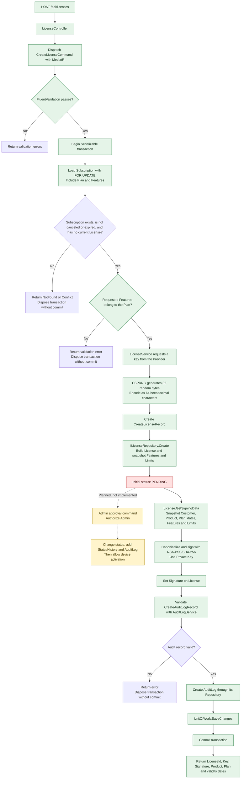
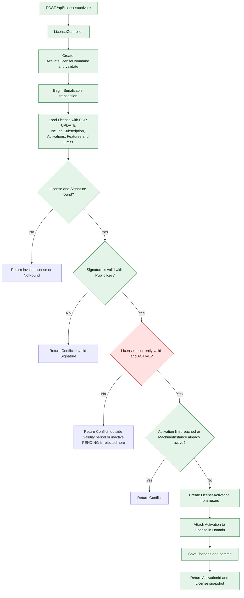
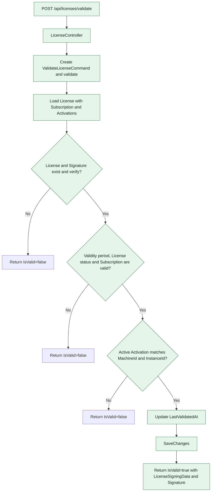
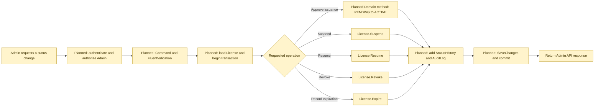

# دیاگرام جریان‌های لایسنس

این سند جریان‌های فعلی صدور، تمدید، فعال‌سازی و اعتبارسنجی لایسنس را از روی کد موجود نشان می‌دهد. گام‌های پیاده‌سازی‌شده با سبز، گام‌های پیشنهادی با زرد و مانع‌های فعلی با قرمز مشخص شده‌اند.

## راهنمای وضعیت

- **پیاده‌سازی‌شده:** مسیر یا قاعده در کد وجود دارد.
- **نیازمند تصمیم/تکمیل:** برای کامل شدن رفتار محصول یا دسترسی عملی به مسیر، کار دیگری لازم است.
- **مانع فعلی:** بر اساس کد فعلی مسیر بعدی به نتیجه‌ی موفق نمی‌رسد.

## صدور لایسنس



### نکته‌ی مهم: گسست بین صدور و فعال‌سازی

صدور، لایسنس را با وضعیت `PENDING` ذخیره می‌کند. در مسیر فعلی Handler فعال‌سازی، قبل از ایجاد Activation، `License.IsValidAt` بررسی می‌شود؛ این تابع فقط برای وضعیت `ACTIVE` مقدار درست می‌دهد. در Application و API فعلی، Command/Endpoint مدیریتی برای انتقال `PENDING` به `ACTIVE` پیدا نشد. متد `License.Activate(...)` فقط Activation دستگاه را اضافه می‌کند و وضعیت خود لایسنس را از `PENDING` به `ACTIVE` تغییر نمی‌دهد. همچنین endpoint صدور از `IssuedByAdminId` ارسالی در Command استفاده می‌کند، ولی بررسی نقش/مجوز Admin در Controller یا Handler فعلی دیده نشد.

در نتیجه، **لایسنس تازه‌صادرشده در وضعیت فعلی نمی‌تواند از مسیر API فعال‌سازی شود** تا وقتی مسیر تغییر وضعیت اضافه شود. باید تصمیم گرفته شود که صدور مستقیماً لایسنس را فعال کند یا یک تأیید مدیریتی جداگانه لازم باشد. پیشنهاد، تعریف Command مدیریتی برای فعال‌سازی/تأیید لایسنس است که مجوز Admin، تغییر وضعیت، ثبت StatusHistory و AuditLog و ذخیره‌سازی اتمیک را انجام دهد.

## تمدید Subscription و امضای مجدد License

```mermaid
flowchart TD
    A[POST /api/subscriptions/{id}/renew] --> B[SubscriptionController]
    B --> C[Create RenewSubscriptionCommand]
    C --> D{FluentValidation passes?}
    D -- No --> D1[Return validation errors]
    D -- Yes --> E[Begin Serializable transaction]
    E --> F[Load Subscription with FOR UPDATE<br/>Include current License and snapshots]
    F --> G{Subscription found?}
    G -- No --> G1[Return NotFound<br/>Dispose transaction without commit]
    G -- Yes --> H[Create SubscriptionRenewal from record<br/>Renew Subscription in Domain]
    H --> I[Publish SubscriptionRenewedNotification<br/>In-process through MediatR]
    I --> J[RenewLicenseAfterSubscriptionRenewalHandler]
    J --> K{Current License exists?}
    K -- No --> K1[Leave License unchanged]
    K -- Yes --> L[Update License expiration and renewal history]
    L --> M[Re-sign LicenseSigningData with RSA-PSS/SHA-256]
    M --> N[SaveChanges and commit in the same transaction]
    K1 --> N
    N --> O[Return Subscription renewal and current License details]

    classDef done fill:#e5f4e8,stroke:#31834b,color:#102b17;
    classDef todo fill:#fff4cc,stroke:#b38b00,color:#403300;
    class A,B,C,D,E,F,H,I,J,K,L,M,N,O done;
    class K1 todo;
```

## فعال‌سازی دستگاه



## اعتبارسنجی در زمان استفاده



## وضعیت عملیات مدیریتی و موارد پیشنهادی بعدی

| مورد | وضعیت فعلی در کد | گام پیشنهادی |
|---|---|---|
| صدور و امضای License | پیاده‌سازی شده؛ وضعیت اولیه `PENDING` | مشخص‌کردن سیاست فعال‌شدن و افزودن مسیر انتقال به `ACTIVE` |
| فعال‌سازی دستگاه و محدودیت Instance/Device | Handler و تراکنش Serializable پیاده‌سازی شده | بعد از رفع گسست وضعیت، تست همزمانی با دیتابیس واقعی |
| تمدید Subscription و License جاری | Notification درون‌برنامه‌ای و امضای مجدد پیاده‌سازی شده | تست rollback و سناریوی License بدون امضای قبلی؛ Outbox فقط در صورت نیاز به پردازش بیرونی/پایدار |
| اعتبارسنجی License | امضا، زمان، وضعیت و Activation بررسی می‌شود | تعریف رفتار و کد پاسخ برای حالت‌های ردشده و تست یکپارچه |
| Suspend / Resume / Revoke | متدهای Domain وجود دارد | افزودن Command، Validator، مجوز Admin، Controller و AuditLog |
| Expire | قاعده‌ی Domain و ردشدن پس از تاریخ انقضا وجود دارد | Worker/Job برای تغییر وضعیت ذخیره‌شده به `EXPIRED` و ثبت تاریخچه، اگر گزارش وضعیت صریح لازم است |
| مجوز دسترسی API | در Controllerهای فعلی `[Authorize]` دیده نشد | محافظت از عملیات مدیریتی و استخراج شناسه Admin از هویت احراز‌شده به‌جای اعتماد به ورودی درخواست |
| آزمون جریان‌ها | تست‌های Domain وجود دارند | تست Application/Infrastructure برای صدور، کلید/امضا، تمدید، رقابت و rollback |

## فایل‌های مرجع اصلی

- صدور: `03-Application/LicenseGuard.Application/Features/License/Commands/CreateLicensesCommand/CreateLicenseCommandHandler.cs`
- فعال‌سازی: `03-Application/LicenseGuard.Application/Features/License/Commands/ActivateLicense/ActivateLicenseCommandHandler.cs`
- اعتبارسنجی: `03-Application/LicenseGuard.Application/Features/License/Commands/ValidateLicense/ValidateLicenseCommandHandler.cs`
- تمدید: `03-Application/LicenseGuard.Application/Features/Subscription/Commands/RenewSubscriptionCommandHandler.cs`
- رویداد تمدید License: `03-Application/LicenseGuard.Application/Features/Subscription/Events/RenewLicenseAfterSubscriptionRenewalHandler.cs`
- قوانین وضعیت و اعتبار License: `01-Domain/LicenseGuard.Domain/Entities/License.cs`
- تولید کلید و امضا: `02-Infrastructure/LicenseGuard.Infrstructure.SecurityService/Services/`


## جریان مدیریتی وضعیت License؛ کار پیشنهادی

متدهای Domain برای `Suspend`، `Resume`، `Revoke` و `Expire` وجود دارند، اما در Application و API فعلی مسیرهای Command/Handler/Controller برای فراخوانی آن‌ها پیدا نشد. این دیاگرام، جریان پیشنهادی آینده را نشان می‌دهد و مسیر پیاده‌سازی‌شده نیست.


